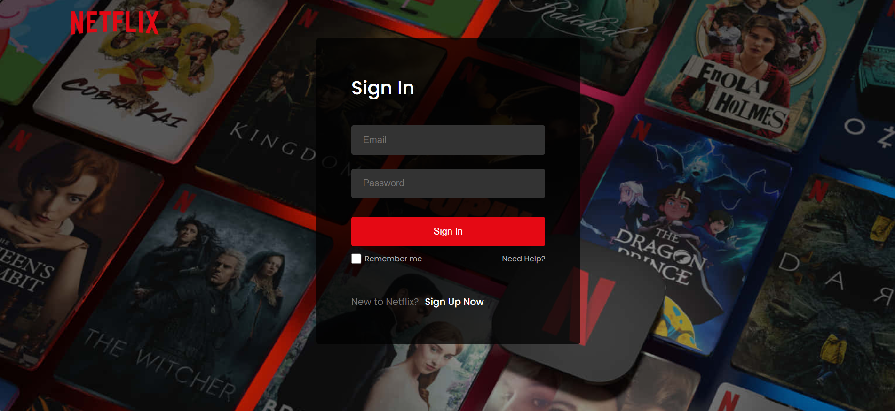

# 🎬 Netflix Clone - Full Stack SPA

A **full-stack Netflix clone** built with **React & Firebase**, focusing on authentication, media streaming, and an interactive UI. This is a **Single Page Application (SPA)** for a seamless user experience.

## 💡 What I Learned

Building this project helped me understand **how to build a full-stack app**, integrating frontend, backend, authentication, and API calls seamlessly.

## 🌟 Features

- 🔐 **Secure Authentication** – User Signup/Login via Firebase
- 🎥 **Dynamic Movie Listings** – Fetched from **TMDB API**
- 🎞️ **Trailer Pop-up** – Click on a movie to watch its trailer
- ⚡ **Single Page Application (SPA)** – Fast & smooth navigation
- 🌍 **Fully Responsive** – Works on mobile, tablet, and desktop
- 🚀 **Firebase Hosting** – Fast and scalable deployment

## 🛠️ Tech Stack

- **Frontend:** React.js, Tailwind CSS
- **Backend:** Firebase Authentication, Firestore
- **APIs:** TMDB API (for movie data)
- **Hosting:** Firebase Hosting

## ⚡ Challenges I Faced

While working on authentication, I learned how to handle:

- `createUserWithEmailAndPassword` for user registration
- `signInWithEmailAndPassword` for login management
- Firebase **authentication state management**

## 🎯 Future Improvements

- 🔎 **Search & Filter** – Allow users to find movies easily
- 👥 **User Profiles** – Save favorite movies & preferences

---

### 🚀 Want to Try It?

Check out the **[live app](https://netflix-clone-6a241.web.app)** or **clone & run locally!**
